<p align="center">
  
</p>

<h1 align="center">TransRail - Sistema de Gestión Ferroviaria</h1>

<p align="center">
  <strong>Sistema académico de gestión de trenes de transporte de pasajeros</strong><br/>
  <em>Aplicación de escritorio en C# que aplica estructuras de datos a una situación problema realista</em>
</p>

<p align="center">
  
  
  
  
  
  
  
</p>

<p align="center">
  <a href="#acerca-del-proyecto">Acerca del proyecto</a> ·
  <a href="#funcionalidades-principales">Funcionalidades</a> ·
  <a href="#arquitectura-del-sistema">Arquitectura</a> ·
  <a href="#estructuras-de-datos-aplicadas">Estructuras de datos</a> ·
  <a href="#inicio-rápido">Inicio rápido</a>
</p>

---

## Acerca del proyecto

**TransRail** es un sistema de gestión de trenes de transporte de pasajeros desarrollado como proyecto académico. Su propósito es demostrar cómo las estructuras de datos pueden aplicarse en una situación problema relacionada con operaciones ferroviarias, control administrativo, compra de boletos, equipaje y abordaje.

El sistema responde a la siguiente situación problema:

> ¿Cómo puede un sistema de gestión de trenes de transporte de pasajeros asegurar el control de las cargas y descargas de los trenes de transporte, a su vez que apoya las labores administrativas?

La solución se construyó como una aplicación de escritorio moderna con **C#**, **.NET 10** y **WinForms**, organizada con una **Clean Architecture ligera** y el patrón **MVP** para separar la interfaz de usuario de la lógica de negocio.

---

## Galería de interfaces

<table>
  <tr>
    <td align="center" colspan="2">
      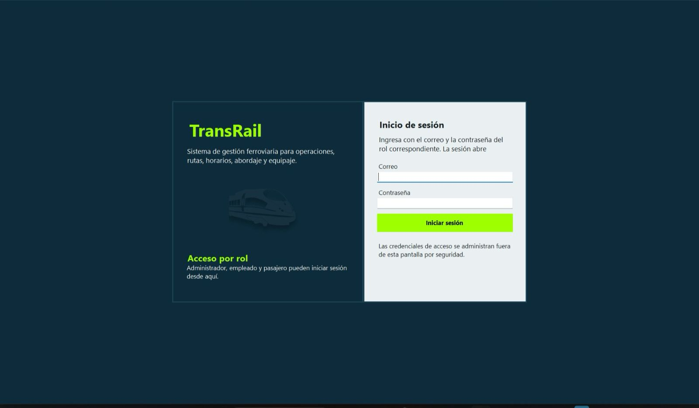
      <br/><strong>Inicio de sesión</strong>
    </td>
  </tr>
</table>

### Panel administrador

<table>
  <tr>
    <td align="center" width="50%">
      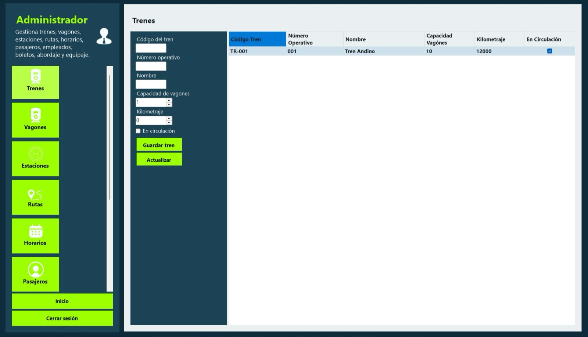
      <br/><strong>Gestión de trenes</strong>
    </td>
    <td align="center" width="50%">
      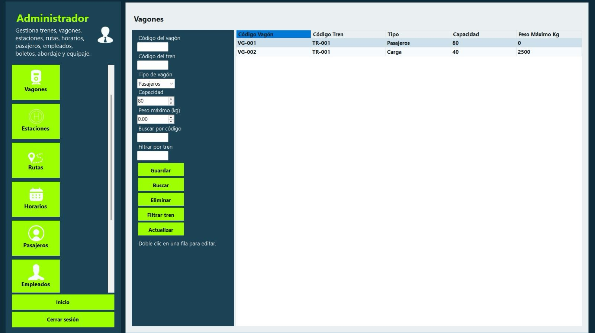
      <br/><strong>Gestión de vagones</strong>
    </td>
  </tr>
  <tr>
    <td align="center">
      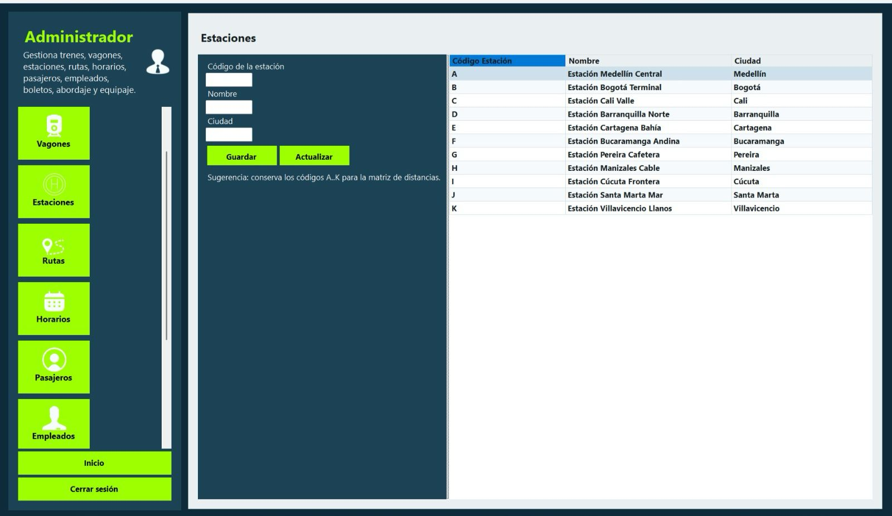
      <br/><strong>Gestión de estaciones</strong>
    </td>
    <td align="center">
      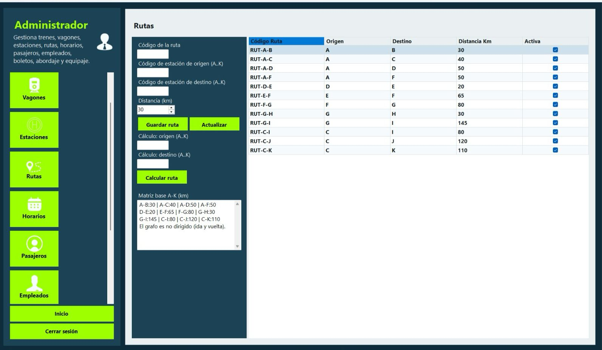
      <br/><strong>Rutas y matriz de distancias</strong>
    </td>
  </tr>
  <tr>
    <td align="center">
      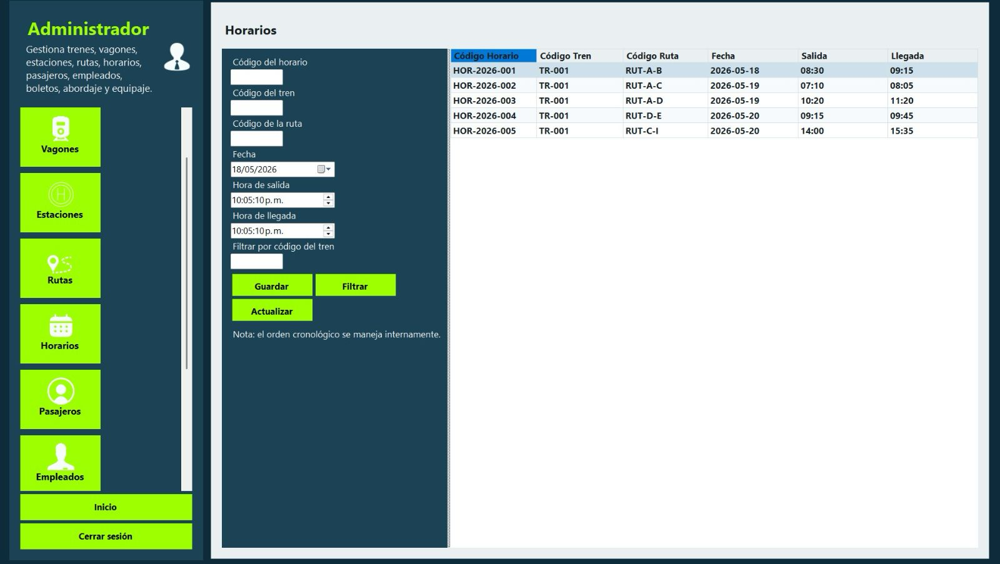
      <br/><strong>Gestión de horarios</strong>
    </td>
    <td align="center">
      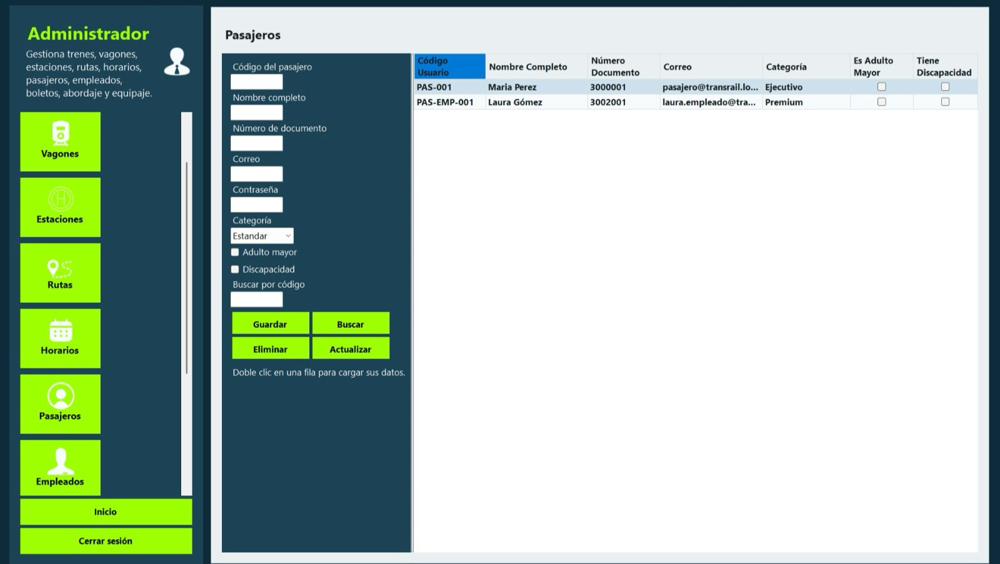
      <br/><strong>Gestión de pasajeros</strong>
    </td>
  </tr>
  <tr>
    <td align="center">
      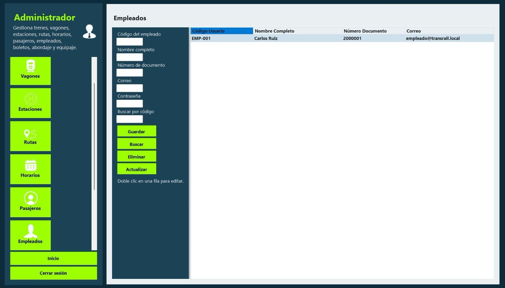
      <br/><strong>Gestión de empleados</strong>
    </td>
    <td align="center">
      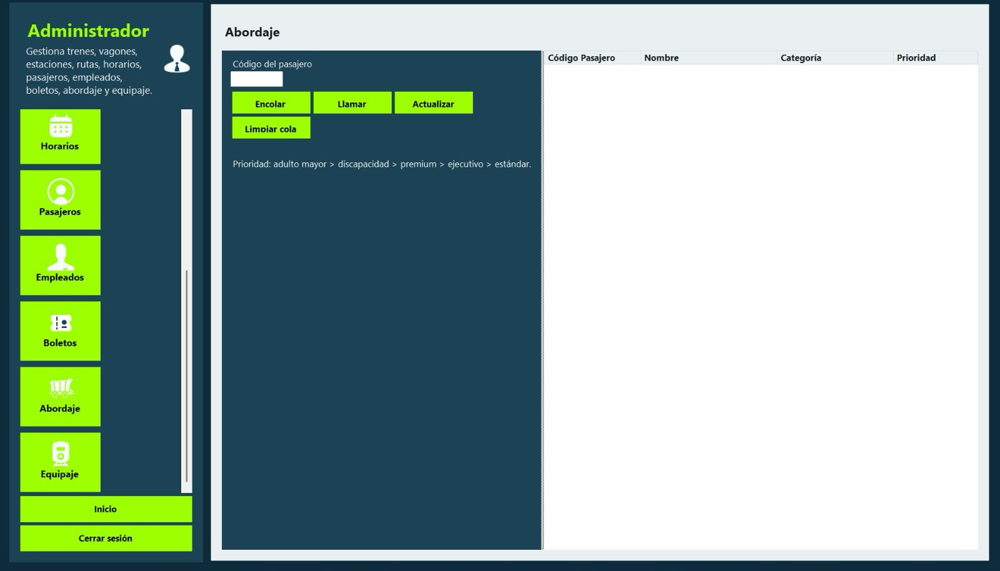
      <br/><strong>Abordaje con cola de prioridad</strong>
    </td>
  </tr>
  <tr>
    <td align="center" colspan="2">
      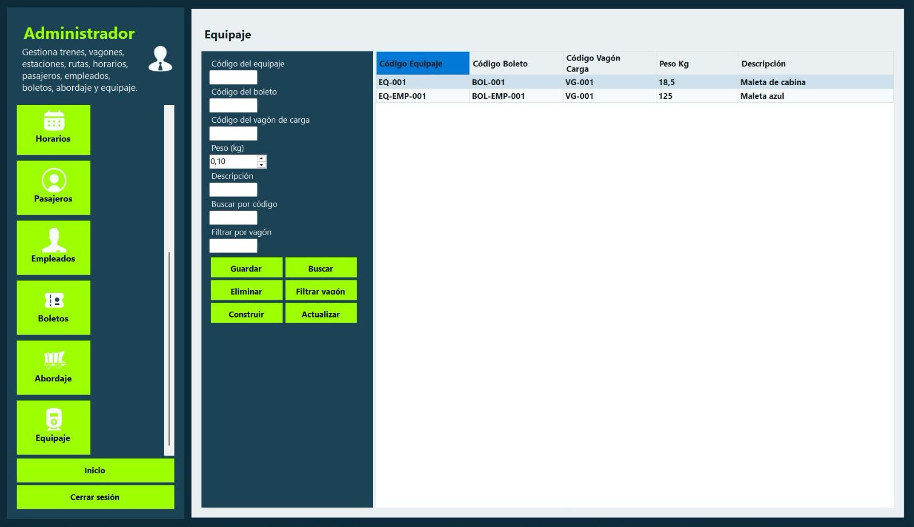
      <br/><strong>Equipaje y pila de carga</strong>
    </td>
  </tr>
</table>

### Panel empleado

<table>
  <tr>
    <td align="center" width="50%">
      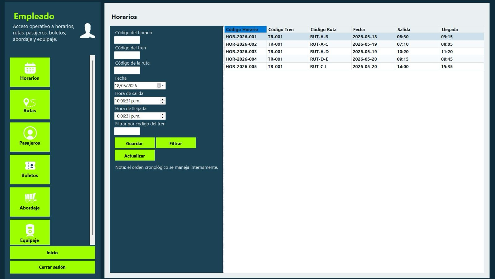
      <br/><strong>Consulta operativa de horarios</strong>
    </td>
    <td align="center" width="50%">
      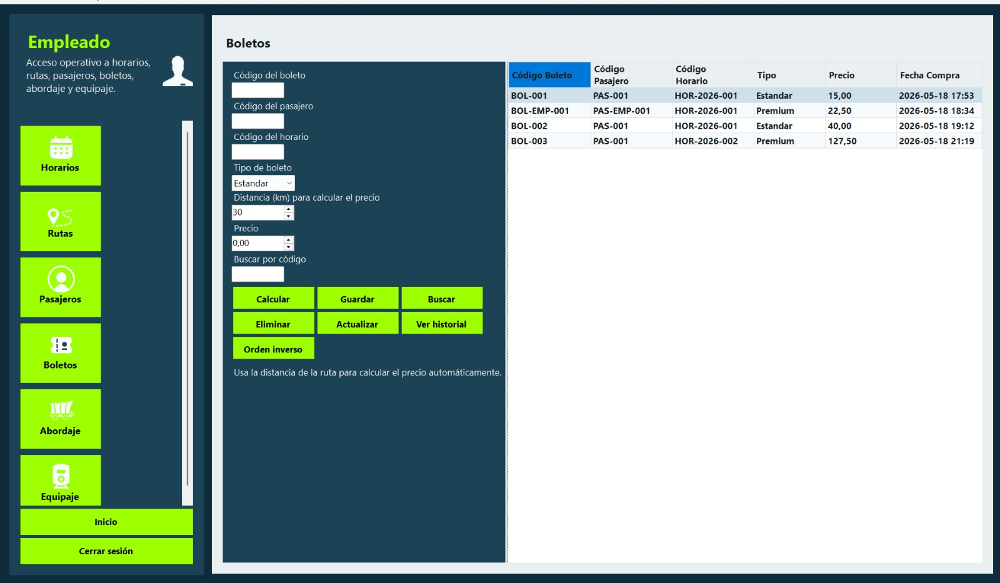
      <br/><strong>Gestión operativa de boletos</strong>
    </td>
  </tr>
  <tr>
    <td align="center" colspan="2">
      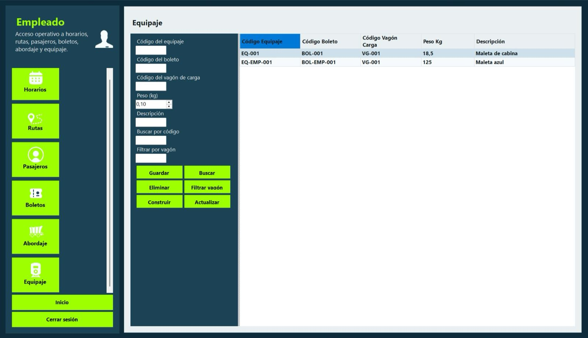
      <br/><strong>Gestión operativa de equipaje</strong>
    </td>
  </tr>
</table>

### Portal pasajero

<table>
  <tr>
    <td align="center" width="50%">
      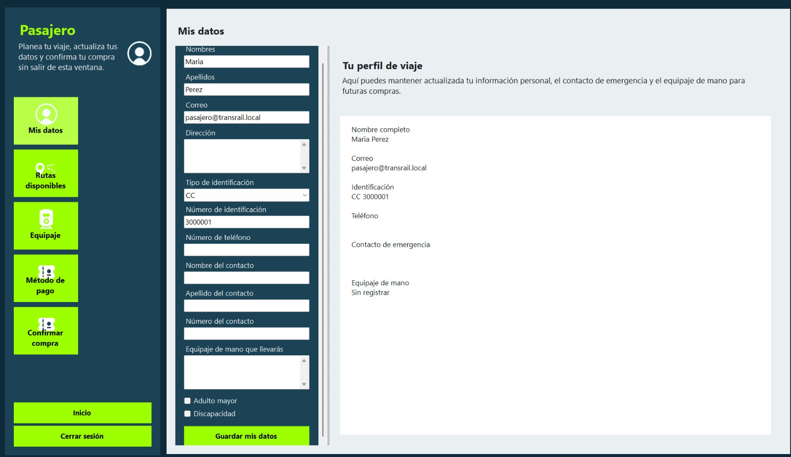
      <br/><strong>Mis datos</strong>
    </td>
    <td align="center" width="50%">
      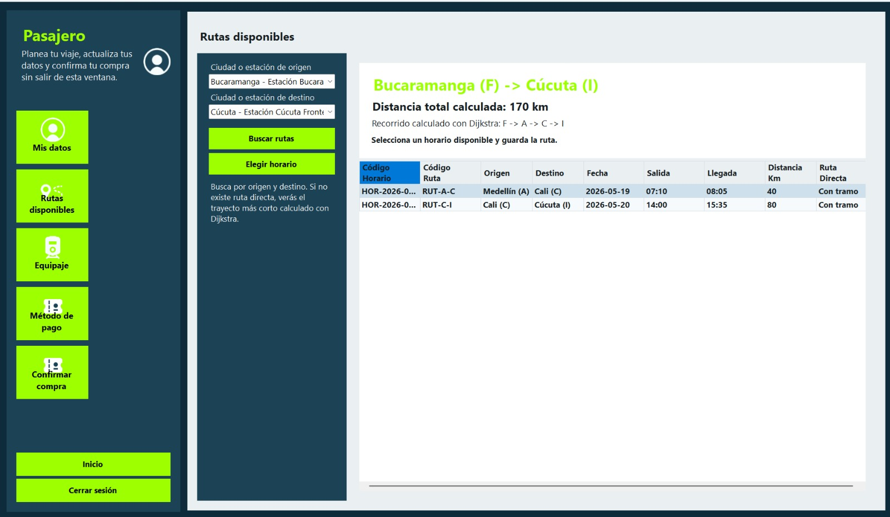
      <br/><strong>Rutas disponibles con Dijkstra</strong>
    </td>
  </tr>
  <tr>
    <td align="center">
      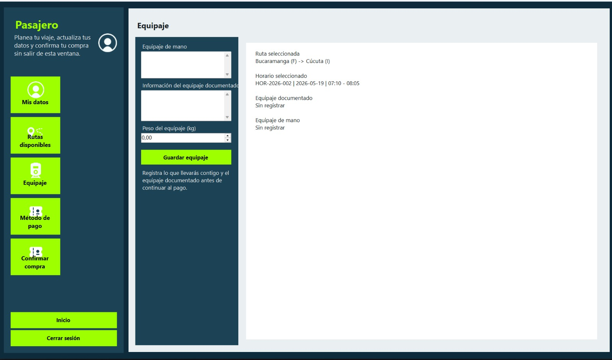
      <br/><strong>Registro de equipaje</strong>
    </td>
    <td align="center">
      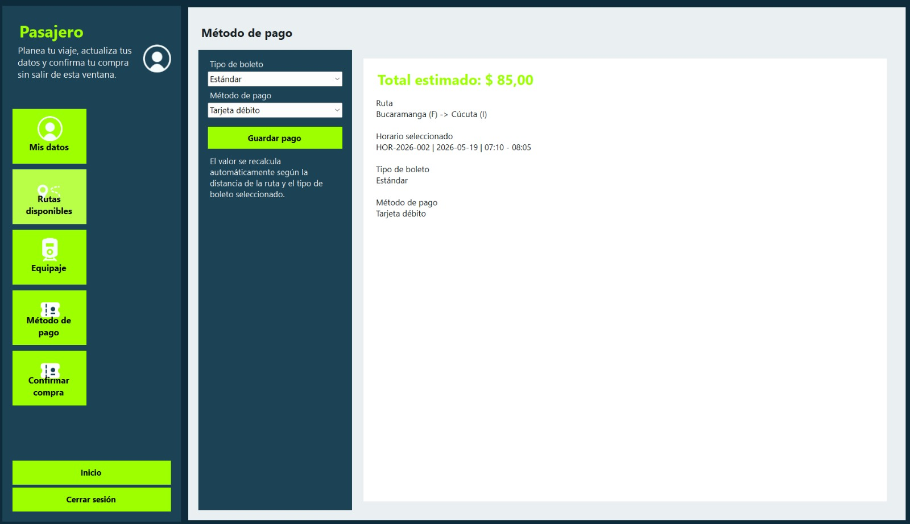
      <br/><strong>Método de pago</strong>
    </td>
  </tr>
  <tr>
    <td align="center" colspan="2">
      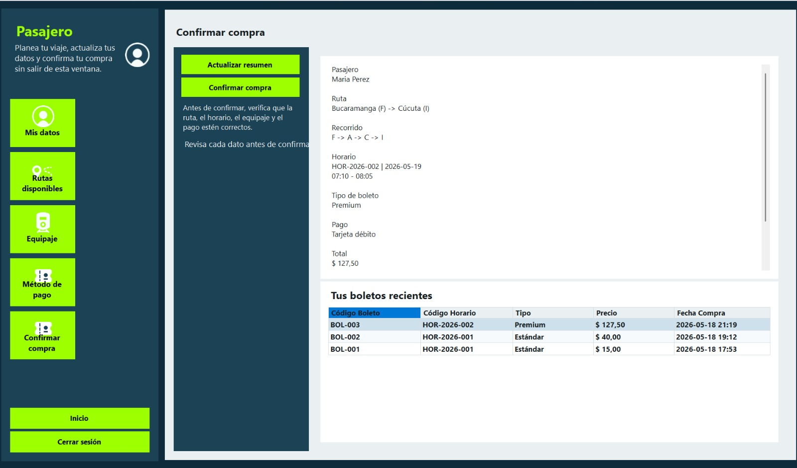
      <br/><strong>Confirmación de compra</strong>
    </td>
  </tr>
</table>

---

## Stack tecnológico

| Capa | Tecnología |
|---|---|
| Lenguaje | C# |
| Plataforma | .NET 10 |
| Interfaz gráfica | WinForms |
| Arquitectura | Clean Architecture ligera |
| Patrón de presentación | MVP |
| Persistencia | JSON por módulo |
| Pruebas | xUnit |
| IDE recomendado | Visual Studio Code con C# Dev Kit |

---

## Funcionalidades principales

- Autenticación por roles: administrador, empleado y pasajero.
- Menús separados según el rol autenticado.
- Gestión de trenes, vagones, estaciones, rutas y horarios.
- Gestión de pasajeros, empleados, boletos, equipaje y abordaje.
- Portal de pasajero con flujo de viaje completo.
- Cálculo de ruta más corta con Dijkstra.
- Persistencia local en archivos JSON.
- Uso académico de estructuras de datos propias.
- Pruebas unitarias para estructuras y reglas principales.

---

## Lógica del negocio

TransRail organiza la operación ferroviaria en tres roles:

| Rol | Responsabilidad |
|---|---|
| Administrador | Mantiene datos maestros: trenes, vagones, estaciones, rutas, horarios, usuarios, boletos, abordaje y equipaje. |
| Empleado | Opera módulos funcionales del servicio: horarios, rutas, pasajeros, boletos, abordaje y equipaje. |
| Pasajero | Planea su viaje, actualiza sus datos, selecciona ruta y horario, registra equipaje, paga y confirma compra. |

### Flujo del pasajero

```txt
Mis datos
↓
Rutas disponibles
↓
Equipaje
↓
Método de pago
↓
Confirmar compra
```

En este flujo el pasajero puede actualizar su información personal, escoger origen y destino, consultar rutas disponibles, seleccionar horario, registrar equipaje de mano o documentado, elegir tipo de boleto, seleccionar método de pago y confirmar la compra.

El valor del boleto se calcula según la distancia de la ruta seleccionada y el tipo de boleto:

| Tipo de boleto | Uso esperado |
|---|---|
| Estándar | Tarifa base del viaje. |
| Ejecutivo | Tarifa intermedia con mayor prioridad que estándar. |
| Premium | Tarifa superior con mayor prioridad de atención. |

---

## Arquitectura del sistema

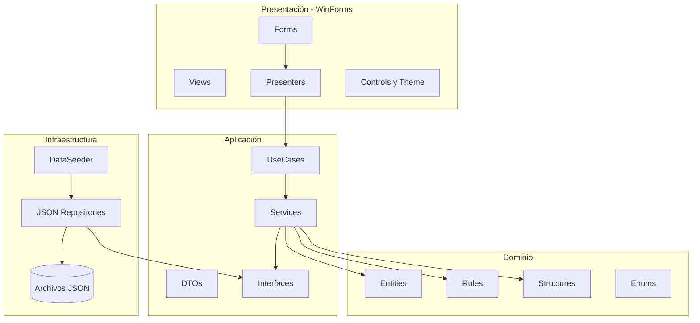
```mermaid
graph TD
    subgraph "Presentación - WinForms"
        F[Forms]
        V[Views]
        P[Presenters]
        UI[Controls y Theme]
    end

    subgraph "Aplicación"
        UC[UseCases]
        S[Services]
        DTO[DTOs]
        I[Interfaces]
    end

    subgraph "Dominio"
        E[Entities]
        R[Rules]
        DS[Structures]
        EN[Enums]
    end

    subgraph "Infraestructura"
        REPO[JSON Repositories]
        JSON[(Archivos JSON)]
        SEED[DataSeeder]
    end

    F --> P
    P --> UC
    UC --> S
    S --> I
    S --> E
    S --> R
    S --> DS
    REPO --> JSON
    REPO --> I
    SEED --> REPO
```

### Regla de dependencias

```txt
TransRail.Presentation -> TransRail.Application, TransRail.Infrastructure, TransRail.Domain
TransRail.Infrastructure -> TransRail.Application, TransRail.Domain
TransRail.Application -> TransRail.Domain
TransRail.Domain -> no depende de WinForms ni JSON
```

---

## Organización del proyecto

```txt
TransRail/
├── TransRail.sln
├── DOCUMENTACION_PROYECTO.md
├── ARCHITECTURE.md
├── MIGRATION_PLAN.md
├── TransRail.Domain/
│   ├── Entities/
│   ├── Enums/
│   ├── Rules/
│   └── Structures/
├── TransRail.Application/
│   ├── DTOs/
│   ├── Interfaces/
│   ├── Services/
│   └── UseCases/
├── TransRail.Infrastructure/
│   ├── Persistence/Json/
│   ├── Repositories/
│   └── Seed/
├── TransRail.Presentation/
│   ├── Forms/
│   ├── Presenters/
│   ├── Views/
│   ├── Controls/
│   ├── Theme/
│   └── Resources/
└── TransRail.Tests/
    ├── Domain/
    ├── Infrastructure/
    └── Structures/
```

---

## Patrones aplicados

| Patrón | Aplicación |
|---|---|
| Clean Architecture ligera | Separación entre dominio, aplicación, infraestructura y presentación. |
| MVP | Los formularios WinForms delegan la lógica en presenters. |
| Repository | La aplicación consume interfaces y la infraestructura implementa JSON. |
| Use Case | El flujo del pasajero se coordina desde casos de uso de aplicación. |
| DTO | Transporte de datos entre presentación y aplicación sin acoplar entidades directamente. |

---

## Estructuras de datos aplicadas

| Estructura | Aplicación en TransRail |
|---|---|
| Tabla hash | Búsqueda rápida de usuarios y códigos operativos. |
| Lista circular | Trenes en circulación. |
| Lista doblemente enlazada | Historial de boletos. |
| Grafo | Estaciones, rutas y cálculo de distancia. |
| Dijkstra | Ruta más corta entre estaciones. |
| Pila | Equipaje por vagón de carga. |
| Cola de prioridad | Abordaje de pasajeros. |
| Árbol AVL | Horarios ordenados por fecha, hora y tren. |

### Matriz base de rutas

```txt
A-B = 30
A-C = 40
A-D = 50
A-F = 50
D-E = 20
E-F = 65
F-G = 80
G-H = 30
G-I = 145
C-I = 80
C-J = 120
C-K = 110
```

### Estaciones base

```txt
A = Medellín
B = Bogotá
C = Cali
D = Barranquilla
E = Cartagena
F = Bucaramanga
G = Pereira
H = Manizales
I = Cúcuta
J = Santa Marta
K = Villavicencio
```

---

## Persistencia

La persistencia inicial se realiza con archivos JSON por módulo:

```txt
TransRail.Infrastructure/Persistence/Json/
├── usuarios.json
├── pasajeros.json
├── empleados.json
├── trenes.json
├── vagones.json
├── rutas.json
├── estaciones.json
├── horarios.json
├── boletos.json
├── equipajes.json
└── pagos.json
```

Esta decisión permite revisar fácilmente los datos durante la sustentación académica. La arquitectura usa interfaces de repositorio, así que en el futuro puede migrarse a SQLite, MySQL o PostgreSQL sin cambiar la lógica de negocio.

---

## Inicio rápido

### Requisitos

- .NET SDK 10.
- Windows para ejecutar WinForms.
- Visual Studio Code con C# Dev Kit recomendado.

### Ejecutar desde la terminal

```powershell
dotnet restore TransRail.sln
dotnet build TransRail.sln
dotnet run --project TransRail.Presentation
```

### Ejecutar pruebas

```powershell
dotnet test TransRail.sln
```

Si la compilación falla porque la aplicación está abierta y bloquea DLLs:

```powershell
Get-Process -Name TransRail.Presentation -ErrorAction SilentlyContinue | Stop-Process -Force
```

---

## Credenciales de prueba

```txt
Administrador
Correo: admin@transrail.local
Contraseña: admin123

Empleado
Correo: empleado@transrail.local
Contraseña: empleado123

Pasajero
Correo: pasajero@transrail.local
Contraseña: pasajero123
```

---

## Documentación completa

- [`DOCUMENTACION_PROYECTO.md`](DOCUMENTACION_PROYECTO.md)
- [`ARCHITECTURE.md`](ARCHITECTURE.md)
- [`MIGRATION_PLAN.md`](MIGRATION_PLAN.md)

---

## Conclusión académica

TransRail demuestra la aplicación de estructuras de datos en un caso de negocio ferroviario. Cada estructura cumple una responsabilidad específica dentro del sistema: la tabla hash apoya búsquedas rápidas, la lista circular representa trenes en circulación, la lista doblemente enlazada organiza boletos, el grafo modela estaciones y rutas, Dijkstra calcula recorridos, la pila gestiona equipaje, la cola de prioridad controla el abordaje y el árbol AVL ordena horarios.

El resultado es una aplicación de escritorio funcional, organizada por capas, con patrón MVP, persistencia JSON y lógica académicamente defendible.
